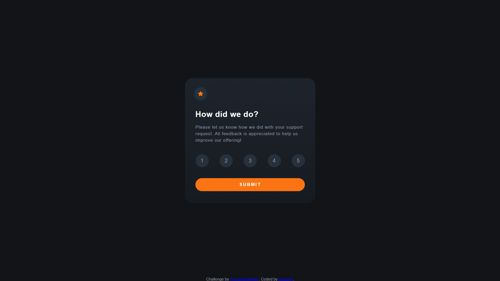
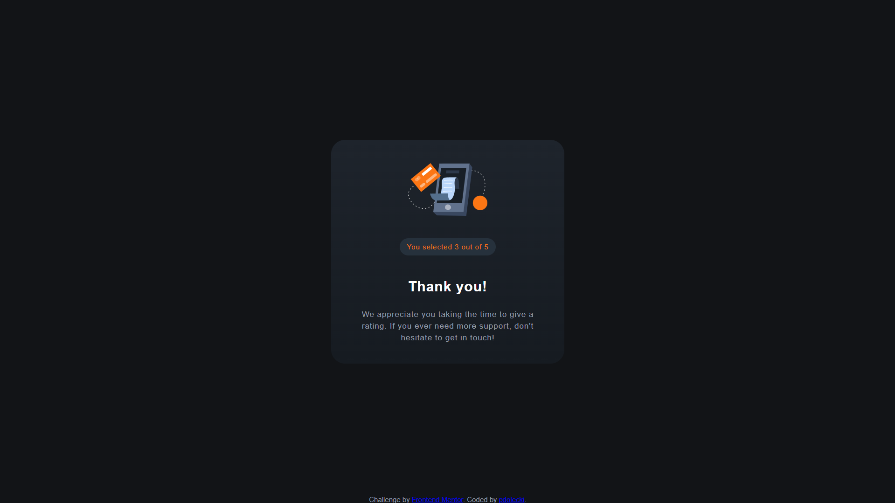

# Frontend Mentor - Interactive rating component solution

This is a solution to the [Interactive rating component challenge on Frontend Mentor](https://www.frontendmentor.io/challenges/interactive-rating-component-koxpeBUmI). Frontend Mentor challenges help you improve your coding skills by building realistic projects.

## Table of contents

- [Overview](#overview)
  - [The challenge](#the-challenge)
  - [Screenshot](#screenshot)
  - [Links](#links)
  - [Built with](#built-with)
  - [Author](#author)

## Overview

Important sidenotes:

- Build based on jpg graphic(not figma sketch)
- Responsive on given layouts(375px/1440px) without media queries

### The challenge

Users should be able to:

- View the optimal layout for the app depending on their device's screen size
- See hover states for all interactive elements on the page
- Select and submit a number rating
- See the "Thank you" card state after submitting a rating

### Screenshot

### Links

- Live Site URL: [@pdolecki-netlify-1](https://pdolecki-interactive-rating-component.netlify.app/)

### Built with

- HTML5
- CSS
- JavaScript

### Author

- Frontend Mentor - [@pdolecki](https://www.frontendmentor.io/profile/pdolecki)
- linkedin - [@pdolecki](https://pl.linkedin.com/in/pdolecki)
